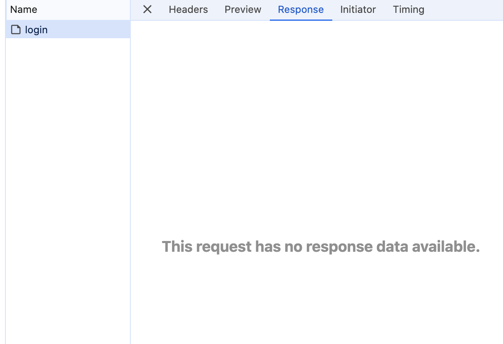
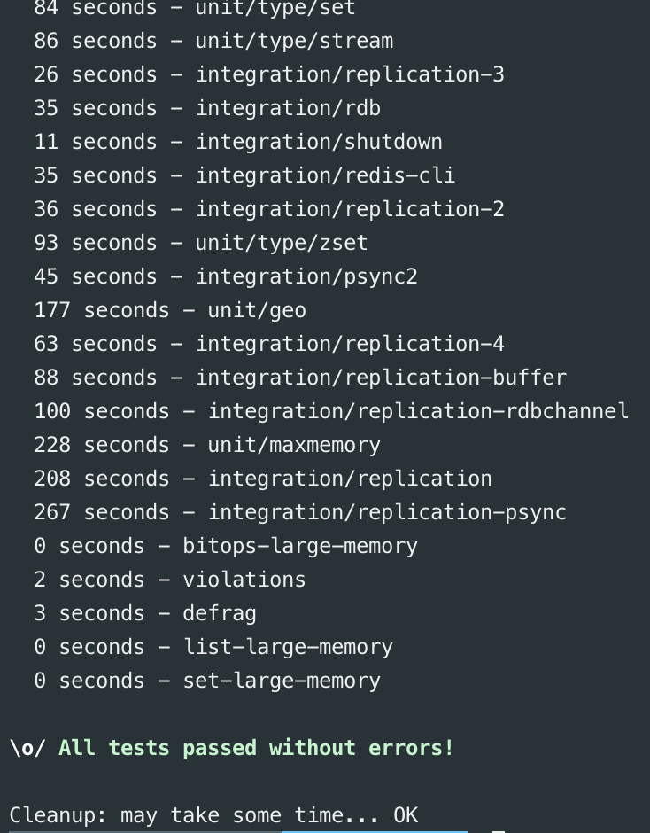
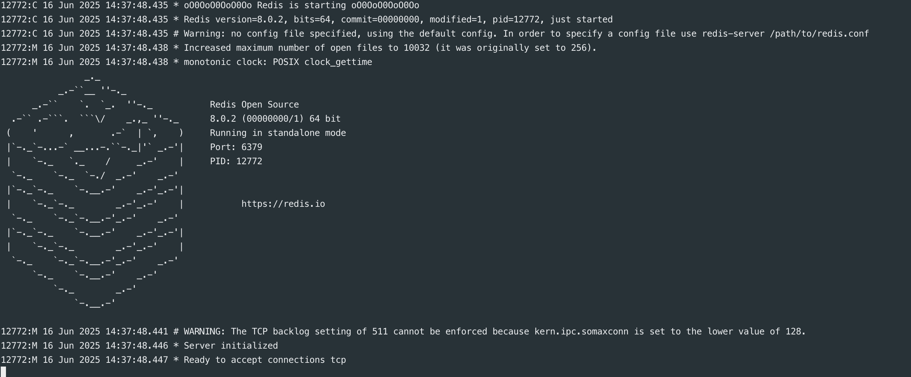
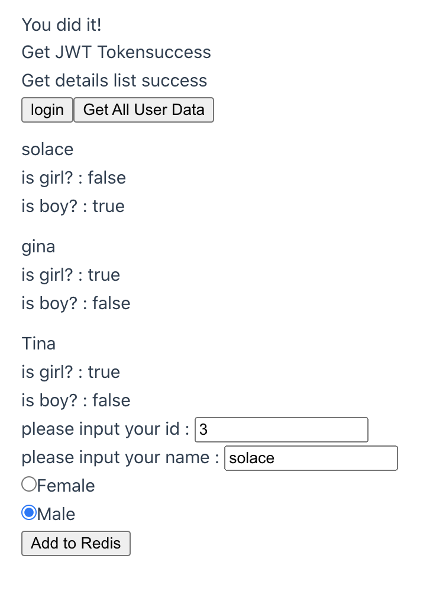

# koa-integration-demo

#### step1 npm i koa koa-router @koa/cors

#### import and create instance of each

#### started koa service


#### design 

#### error catch middleware at top
```
// step 1 add middleware at top to handle business error and expose it
app.use(async (ctx, next)=> {
    try {
        next()
    } catch (err) {
        ctx.status = err.statusCode || err.status || 500;
        throw err
    }
})
```
##### throw specific error at router layer by both `try-catch` and inner provided method 
```
// step2 throw error based on business
router.get('/getName', async(ctx, next) => {
    try {
        // TODO business logic
    } catch (err) {
        ctx.throw( 400, 'parameters error : wrong user id' )
    }
})
```
##### listen error event globally which were provided defaultly  
```
// by using app.on
app.on('error', (err, ctx) => {
    // TODO error handle
})
```

### Issue check
##### <li> no response in chrome devtools - network


RCA: missing type of response<br> 
fixed: ctx.type = "json"

##### <li> get local file json data while using `readFileSync` or `readFile`
RCA: both methods defaulting returns buffer data
fixed: add decode type `await fs.readFileSync('./userInfo.json', 'utf8');`


#### POST request. need `npm i koa-bodyparser`. otherwise can't get the body query


### Redis Setup([Redis](https://redis.io/downloads/))

#### <li> download
#### <li> `make` compile
#### <li> `make test` compile test(takes time. depends your computer)

#### <li> `make install`

#### <li> `redis-server`
#### <li> command start redis-cli `redis-cli`

##### demo:

